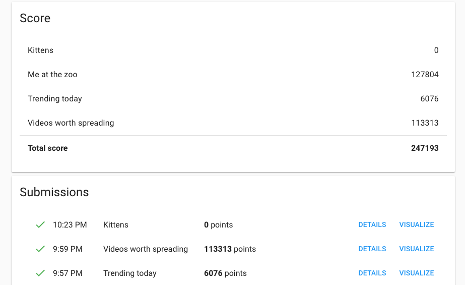
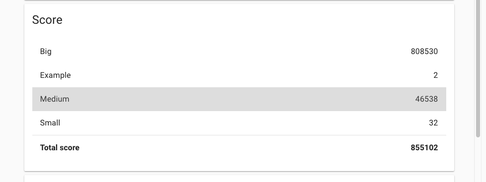

# smartapps_google_hashcode

## Summary

Optimize video caching on different cache servers depending on their popularity.

## Team

- Vincent Chann : lead developer
- Camille Durif : algorithm solver
- Aurélien Haie : algorithm solver

## Roadmap

- gh-01 : Init project
- gh-02 : Develop algorithm
- gh-03 : Optimize algorithm

## Links

- live qualification : https://hashcode.withgoogle.com/oqr.html
- judge system submission : https://hashcodejudge.withgoogle.com/#/rounds/5293824016384000/submissions/

## Final Score 

#397 in France
#2436 in the world

# Training

## Summary

Optimize pizza cutting to get at least L mushrooms & tomatoes on each part and a maximum of R cells.

## Final Score 

